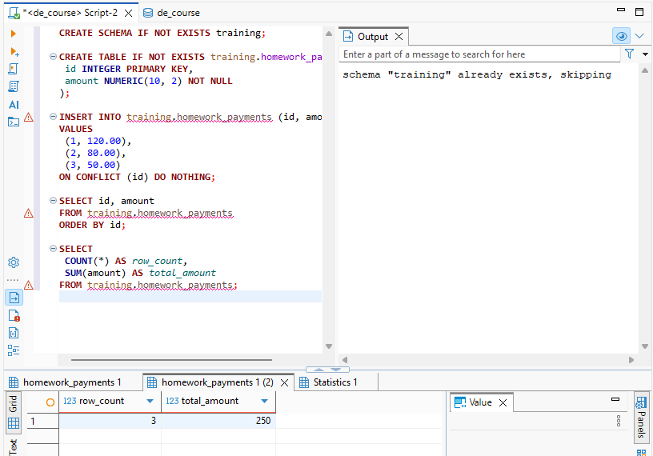

Назначение проекта

Проект предназначен для обучения работе с базами данных и автоматической проверкой данных в приложении на Python. В рамках проекта выполняется создание учебной базы в PostgreSQL, проверка структуры и содержимого данных через SQL, а также верификация результатов с помощью Python-скрипта.

## Используемые версии

- Python: 3.14.3
- PostgreSQL: 16

## Имя учебной базы

`de_project`

## Установка зависимостей

```bash
python -m pip install -r requirements.txt
```

## Порядок выполнения SQL-проверки

1. Запустить сервер PostgreSQL.
2. Создать базу данных `de_project`.
3. Подключиться к базе командой `psql -U postgres -d de_project`.
4. Выполнить SQL-скрипты в следующем порядке:
   1. создание таблиц и схемы;
   2. заполнение исходными данными;
   3. проверочные запросы и SQL-проверки.
5. Убедиться, что все запросы возвращают ожидаемые результаты без ошибок.

## Команда запуска Python-проверки

```bash
python src/check_connection.py
```


## Путь данных

Ежедневный отчет формируется за предыдущий календарный день и объединяет данные
о заказах, платежах и возвратах.

### Схема потока

1. **Источники.** Заказы поступают из операционной базы данных интернет-магазина,
   платежи - через API платежного сервиса, а возвраты - в виде CSV-файла.
2. **Загрузка (ingestion).** Планировщик ежедневно извлекает из базы только новые
   или изменившиеся заказы, получает платежные данные через API с пагинацией и
   сохраняет входящий CSV. На этом шаге данные доставляются в платформу обработки
   с фиксацией времени загрузки и источника.
3. **Staging.** В staging сохраняются исходные данные почти без изменений: отдельно
   для заказов, платежей и возвратов. Здесь удобно повторить загрузку, проверить
   формат, обязательные поля, дубликаты и полноту, не затрагивая отчетные таблицы.
4. **Хранилище (DWH).** Проверенные данные приводятся к общим типам и ключам,
   после чего сохраняются в фактовых таблицах заказов, платежей и возвратов и в
   справочниках дат, клиентов и статусов. Хранилище хранит историю и дает единый
   источник достоверных данных для аналитики.
5. **Трансформации.** Заказы, платежи и возвраты связываются по идентификаторам,
   статусы нормализуются, суммы приводятся к согласованной валюте, а возвраты
   вычитаются из оплаченных заказов по правилам бизнеса. Результат фильтруется по
   предыдущему календарному дню и проверяется на дубликаты и пропуски связей.
6. **Витрина.** В отдельной дневной витрине хранятся показатели для отчета:
   число заказов, сумма заказов, число и сумма успешных платежей, число и сумма
   возвратов, а также итоговая сумма после возвратов. Витрина упрощает запросы
   руководителя и обеспечивает одинаковое определение метрик.
7. **Отчет.** BI-инструмент или SQL-запрос читает витрину после успешного запуска
   загрузки и публикует ежедневный отчет за предыдущий день.

### ETL или ELT

Для этой схемы выбирается **ELT**: данные сначала загружаются в staging и
хранилище, а очистка, объединение и расчет показателей выполняются средствами
хранилища. Это позволяет сохранить исходные данные для повторной обработки,
удобно изменять бизнес-правила и использовать масштабируемые SQL-трансформации.
До загрузки допустимы только технические действия, необходимые для приема данных,
например разбор CSV или обработка пагинации API.

### Ответственность команды

- **Data Engineer** строит загрузки из базы, API и CSV, настраивает расписание,
  staging, контроль качества, повторные запуски и мониторинг.
- **Analytics Engineer** моделирует таблицы DWH и витрину, нормализует статусы и
  определяет воспроизводимые SQL-трансформации для метрик.
- **Data Analyst** согласует формат отчета, проверяет показатели, анализирует
  отклонения и формулирует выводы для руководителя.

Data Engineer должен уточнить у бизнеса: что считается заказом, успешным платежом
и возвратом, как учитывать отмены и частичные возвраты, в какой валюте и часовой
зоне считать предыдущий день, а также ожидаемую полноту отчета. У разработчика API
платежей нужно уточнить контракт API, схему и значения статусов, идентификаторы
заказа и платежа, пагинацию, лимиты и ретраи, часовой пояс, доступную историю и
правила идемпотентной повторной загрузки.

### Разработка и выпуск

Изменения разрабатываются в отдельной ветке и проверяются в DEV или локальном
окружении на тестовых данных. После code review запускаются автоматические проверки:
тесты трансформаций, проверки схемы и качества данных. Затем изменение проходит
staging-проверку на приближенных к реальным данных и через CI/CD попадает в PROD.
В PROD выполняются только одобренные миграции и задачи загрузки с контролем
мониторинга и возможностью отката.

Для учебной работы доступ на запись в PROD не нужен: задание проверяет понимание
архитектуры, SQL и качества данных, а запись в продуктив может повредить реальные
данные, нарушить отчетность и обойти процесс review. Достаточно read-only доступа
или локальной учебной базы с копией данных.


## Результаты проверки
